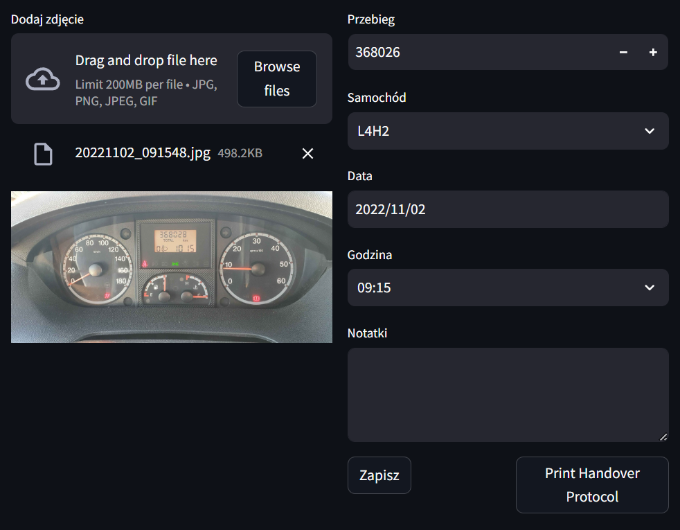
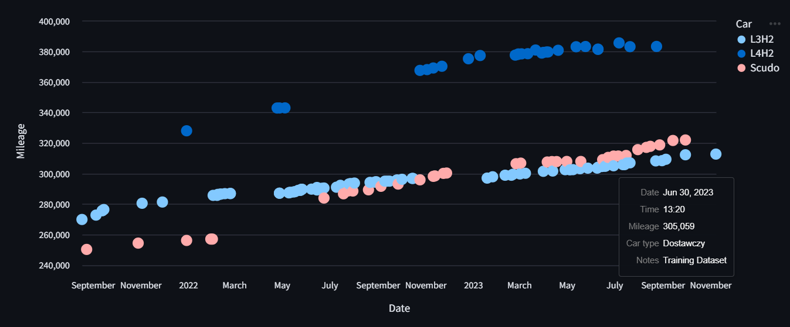
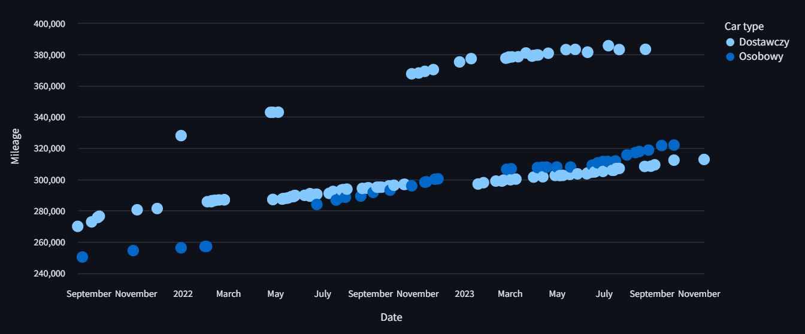

# RentML - Car Rental Management System

## Problem

Managing a car rental business requires meticulous documentation. Each vehicle handover involves:
- Verifying current mileage
- Identifying the vehicle
- Recording date and time
- Filling, signing and archiving protocols

When done manually, this process is time-consuming and error-prone.

App is working on authentic data for a Polish car rental business. Because of that, some elements are named in Polish language.

## Solution

RentML automates car rental management processes:

### Key Features:

1. **Automated Data Recognition**
   - Dashboard image analysis
   - Vehicle model identification
   - Mileage reading with OCR

2. **Smart Prediction**
   - System suggests vehicle model based on historical data
   - Auto-filled forms save time

3. **Document Generation**
   - Instant handover protocol creation
   - Print-ready format (DOCX)
   - Easily adjustable template

4. **Data Visualization**
   - Interactive mileage charts
   - Fleet usage trend analysis

## Benefits

- **Time Saving**: Registration process reduced from minutes to seconds
- **Error Elimination**: Automatic recognition prevents documentation mistakes
- **Easy Data Access**: Mileage history and usage always available
- **Mobility**: Register directly from mobile device

## How It Works

1. Take a dashboard photo or upload existing one
2. System automatically recognizes model and mileage
3. Verify and complete data in the form
4. Save to database and/or generate protocol

## Tech Stack

- **Python**: Core programming language
- **PyTorch**: Binary classification model trained for dashboard recognition
- **EasyOCR**: Optical Character Recognition for mileage reading
- **Pandas**: Data manipulation and analysis
- **Altair**: Interactive data visualization
- **Streamlit**: Web application interface
- **SKLearn**: Data clustering

## Challenges Faced

- **Dashboard Similarity**: Two delivery vehicles had identical dashboards, making trained ML model classification insufficient
- **Clustering Solution**: Implemented a clustering approach to differentiate between similar dashboard types
- **OCR Quality**: The dataset wasn't created with OCR in mind. Extremely poor outliers were removed, and while some reading fluctuations remain (shouldn't happen while measuring car mileage increase over time), the results were deemed acceptable for practical use.

Recognized by ML model

Clustered

---

Project created by Mateusz Ratajczak as a post-mortem automation of own business.